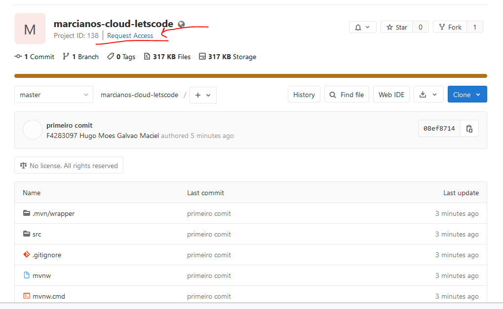

# Instruções 

1. Solicitar acesso ao projeto:

1. Entrar em contato com [Hugo](https://humanograma.intranet.bb.com.br/F4283097) para liberar acesso ao projeto;

2. Executar o comando ``git config --global http.sslVerify false`` ;

3. Clonar o projeto;

4. Configure o seu usuário, abrindo o terminal e executando o   comando abaixo dentro da pasta do projeto:  
    ``git config user.name "F9999999 Seu nome completo" --global``   
    e   
    ``git commit --amend --author="FXXXXXXX Nome Completo <seuemail@bb.com.br>"``

